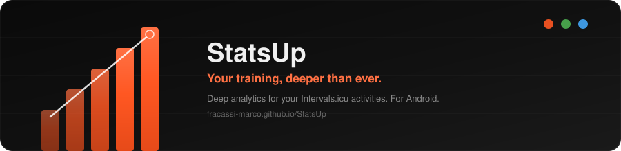
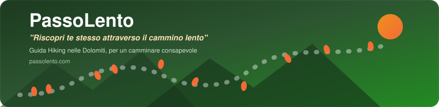

## Hi there 👋

<!--
**fracassi-marco/fracassi-marco** is a ✨ _special_ ✨ repository because its `README.md` (this file) appears on your GitHub profile.

Here are some ideas to get you started:

- 🔭 I’m currently working on ...
- 🌱 I’m currently learning ...
- 👯 I’m looking to collaborate on ...
- 🤔 I’m looking for help with ...
- 💬 Ask me about ...
- 📫 How to reach me: ...
- 😄 Pronouns: ...
- ⚡ Fun fact: ...
-->

### 🚀 Progetti in evidenza

  <a href="https://fracassi-marco.github.io/StatsUp/"><b>StatsUp</b></a> — <i>"Your training, deeper than ever."</i>
   
  Deep analytics for your Intervals.icu activities. Track progress, earn badges, and discover your personal bests with StatsUp for Android.
   
  <a href="https://fracassi-marco.github.io/StatsUp/">🔗 fracassi-marco.github.io/StatsUp</a>

 

  <a href="https://passolento.com/"><b>PassoLento</b></a> — <i>"Riscopri te stesso attraverso il cammino lento"</i>
   
  Guida Hiking nelle Dolomiti, per un camminare consapevole.
   
  <a href="https://passolento.com/">🔗 passolento.com</a>

